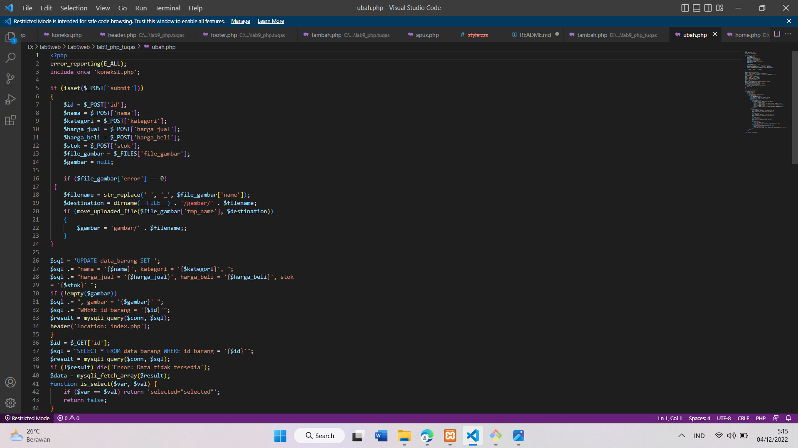
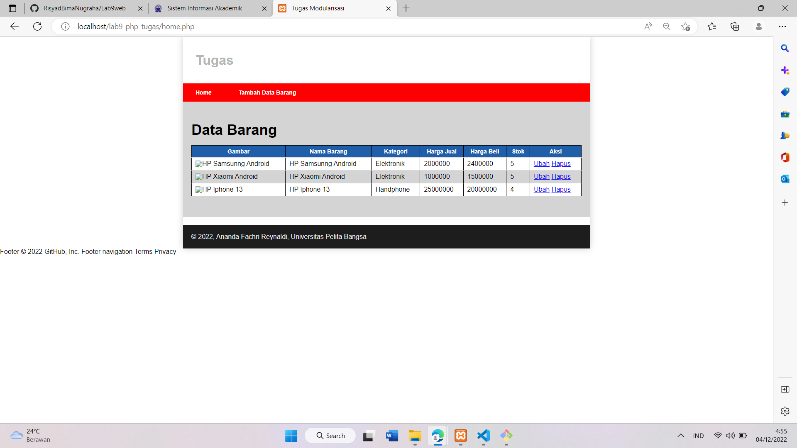

# Lab9web
# Risyad Bima Nugraha
# 312110039
# TI.21.B1
 
<b>XAMPP</b>

Buka XAMPP Control Lalu Klik `Start` untuk menjalankan MySQL Server. Pastikan web server Apache dan MySQL Server sudah dijalankan.
 

Membuat Folder `lab9_php_modular` pada root directory web server (d:\xampp\htdocs)
 

<b>Praktikum</b>

Membuat file baru dengan nama `header.php`
 

Membuat file baru dengan nama `footer.php`
 

Membuat file baru dengan nama `home.php`
 

Membuat file baru dengan nama `about.php`
 

<b>Tugas</b>

Membuat Folder `lab9_php_tugas` pada root directory web server (d:\xampp\htdocs)

Membuat file koneksi untuk menguji koneksi database lalu tampilkan "Koneksi berhasil" dengan perintah `Echo`
 

Membuat file baru dengan nama `header.php`
 

Membuat file baru dengan nama `footer.php`
 

Membuat file baru dengan nama `home.php`
 

Membuat file baru dengan nama `tambah.php`
 

Membuat file baru dengan nama `ubah.php`
 

Membuat file baru dengan nama `hapus.php`
 

Membuat file baru dengan nama `style.css`
 

Hasilnya : 
Tampilan Home
 

Tampilan Tambah Data Barang
 

Tampilan Ubah Barang
 